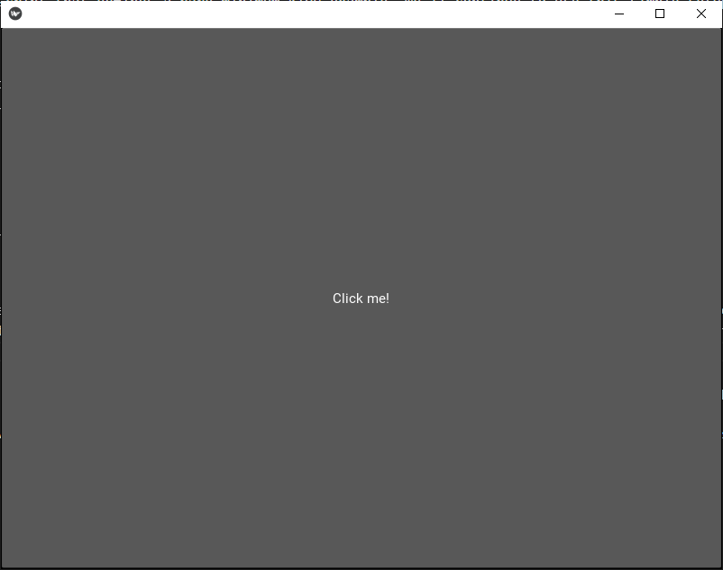
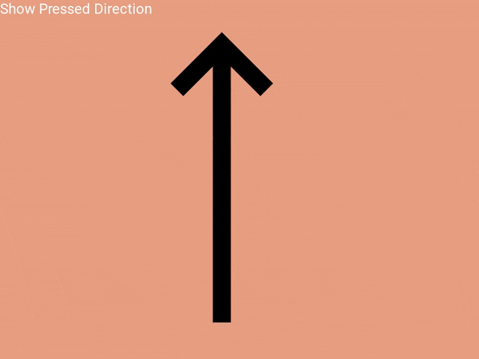
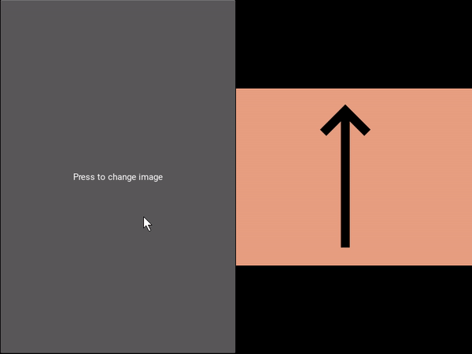
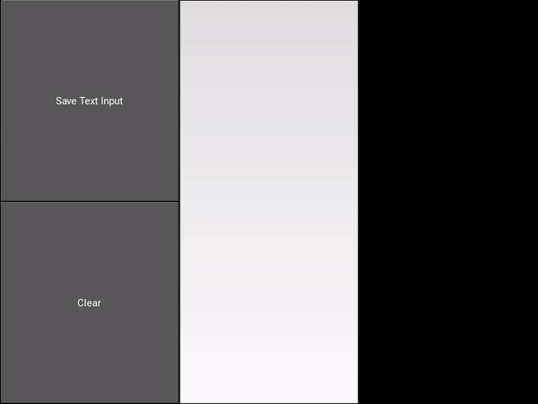

[Kivy](https://kivy.org/doc/stable/) is an open-source visual programming framework, that supports the development of cross-platform Python applications. Kivy uses a custom markdown-style language, [kvlang](https://kivy.org/doc/stable/guide/lang.html), to describe the component structure, style, and functionality. The kv language is a feature-rich and nuanced declarative language that can be challenging to fully appreciate when first encountering Kivy.

In this article, we will explore some of the core features of kvlang through four code examples, available on [GitHub](https://github.com/Joshua-Douglas/KvlangStylingTutorial). We will begin by looking at the basics of kvlang, including its syntax and structure. We will then move on to how kvlang is used to style widgets in Kivy, by demonstrating the support for custom properties, references, and events.

## Understanding kvlang

Before we dive into how kvlang is used to style widgets in Kivy, let's take a look at the basics of kvlang. Kivy refers to visual components as widgets. Widget all descend from the `Widget` class, and represent graphical elements which respond to inputs. Widgets are the core building block of applications, and they can be thoroughly described using the kv language.

Custom widget types are declared in kvlang using the following basic structure:

```kvlang
<MyCustomWidget>: # This is the new widget class name
    string_property: "kvlang"  # A custom string property, with default value "kvlang"
```

In addition to specifying class fields, indentation is also used to describe the structure of an application. Entire widget trees can be defined using a parent-child relationship expressed through indentation. Children of widgets are defined in indented blocks, with each level of indentation indicating a nested child. The meaning of the indentation, however, depends on the context of the root element.

```python
# Declare a custom layout widget type
# This new type descends from BoxLayout, defines a custom
# integer property and has two button children
<MyCustomWidget@BoxLayout>:
    integer_property: 42 # A custom numeric property, with default value 42 
    Button:
        text: "First Button"
    Button:
        text: "Second Button"

# Use our new type
# Add a third button as an additional child
MyCustomWidget: # Note the lack of angle brackets!
    integer_property: 29 # Override the default value. Set to 29
    Button:
        text: "Third Button"
```

The first code block declares a new python class, named `MyCustomWidget` and descending from the pre-existing `BoxLayout` class. The second block uses our new class, as the root widget within an application. We use the widget by setting the `integer_property` to a custom value, and adding an additional `Button` child.

If that is all too much, then don't worry. We have some examples to begin clearing things up.

## Styling widgets with kvlang

Let's take a look at how kvlang is used to style widgets in Kivy. Kvlang supports a whole host of features useful in application developing, such as the use of instance variables, simple python expressions expressions, event dispatching, and widget inheritance. We can begin exploring these concepts through small, practical examples.

### Bare Minimum Kivy Project

Most large projects will typically store Kvlang separate from the Python code, in standalone files that use the `.kv` file extension. These files are nothing more than plain text files that store commands that are parsed by kivy's language parser. It is easy to quickly experiment with `kivy` features by writing `kvlang` as a string, and loading them using a couple of simple commands.

Here is an example python script that defines a bare-minimum kivy example. We'll continue to use this simple setup throughout the article, because it simplifies the overall setup. If you have kivy installed you can type these commands into the python REPL, or run the file using python.

```python
from kivy.lang import Builder 
from kivy.app import runTouchApp

kvlang = '''\
Button:
    text: 'Click me!'
'''
root_widget = Builder.load_string(kvlang)
runTouchApp(root_widget)
```

In this example we define a kvlang string that creates a Kivy `Button` widget with the text "Click me!". We create the `Button` instance by using `Builder.load_string()`, which parses the kvlang and returns the root widget instance. Once we have the widget instance, we use `runTouchApp()` to display the button in a window. The final result is a window containing a single button:



### Dynamic Widget Class

One of the most powerful features of kvlang is its ability to dynamically create widget class definitions, without the need for a python declaration. The kvlang class declaration syntax is nearly as robust as the python language itself, allowing us to define widgets using inheritance and custom properties.

Here is an example kvlang class declaration:

```python
from kivy.lang import Builder
from kivy.app import runTouchApp

kvlang = '''
# Declare a new class using <Name@Parent> syntax.
# Button is a fancy Label that responds to clicks, and 
# uses a background image to display its state
<PressDirectionButton@Button>:
    background_normal: 'button_up.png'
    background_down: 'button_down.png'
    font_size: 24
    color: 1, 1, 1, 1
    halign: 'left'
    valign: 'top'
    text_size: self.width, self.height

# This will be the root widget
# Using the class name directly declares an instance.
BoxLayout:
    PressDirectionButton:
        text: 'Show Pressed Direction'
'''

root_widget = Builder.load_string(kvlang)
runTouchApp(root_widget)
```

In this example, we use the `<ChildClass@ParentClass>` syntax to dynamically create a new class named `PressDirectionButton`. This new class descends from `Button`, and overrides several of the `Button` default properties, to provide a template button that we can re-use throughout our application. The `PressDirectionButton` instance within `MyWidget` will be created with a background that changes each time the button is pressed. The final application looks like this:



### References

Another feature of kvlang that is commonly used for styling widgets is the ability to reference other widgets. References allow widgets to synchronize their properties, and respond to changes on other widgets. The kivy framework will perform the synchronization automatically, allowing us to focus more on defining behavior then worrying about the event registration code.

We can use references to modify our second example. Instead of updating the background of a `Button`, we can use button's pressed state to control the source of an image that is contained elsewhere in the application.  

```python
from kivy.lang import Builder
from kivy.app import runTouchApp

kvlang = '''
<PressDirectionImage@Image>:
    # is_up is a custom property, defined here
    is_up: False
    source: 'button_up.png' if self.is_up else 'button_down.png'

BoxLayout:
    Button: 
        id: controller_button
        text: 'Press to change image'
    PressDirectionImage:
        id: example_img
        is_up: controller_button.state == 'normal'
'''

root_widget = Builder.load_string(kvlang)
runTouchApp(root_widget)
```

In this example, we define a custom image widget called `PressDirectionImage` that contains a boolean property, `is_up`. We use python-like conditional logic directly in the kvlang, so that when `is_up` is true the `PressDirectionImage` shows an up arrow, and when it is false it shows an down arrow. The `PressDirectionImage.is_up` property is synchronized with the `Button.state` property, by using a bit more conditional logic (`controller_button.state == 'normal`). Kvlang supports simple python syntax, and will automatically update `example_img.is_up`'s value whenever `controller_button.state` changes.

The final application contains a button that directly the display of an image, like this:


The automated reference updates greatly simplify the final application code. Without this synchronization we would need to write our own state management code to properly respond to changes. More code typically means more room for bugs - so the automatic updates are nice. There are, of course, cases where more in-depth logic might be required. Fortunately, kivy provides a rich event system to support additional complexity when needed.

### Events

If automatic property updates are not enough, kvlang is also capable of executing any python code stored on a widget. This allows us to take advantage of event-driven programming, without the hassle of creating events with pre-defined event handlers.

Kvlang does not allow you to implement arbitrary methods in python, so to fully utilize events in kivy you'll need to combine kvlang and python source code. The following example demonstrates how to achieve this.

The `SaveLabel` class has two declarations - one in python and one in kvlang. These declarations are combined by the kvlang parser to create a single python class, to allows developers to combine the best aspects of kvlang programming with traditional python programming.

```python
from kivy.lang import Builder
from kivy.app import runTouchApp
from kivy.uix.label import Label
from kivy.properties import NumericProperty

class SaveLabel(Label):

    # This could be a simple python variable
    # Declaring a NumericProperty makes this 
    # property accessible from kvlang (not needed here)
    entry_cntr = NumericProperty(0)

    def save(self, text_to_save):
        # Do not save empty strings or null values
        if not text_to_save:
            return
        self.entry_cntr += 1
        self.text += f'Entry {self.entry_cntr}:\n{text_to_save}\n'

kvlang = '''
<SaveLabel>:
    text_size: self.width, self.height
    halign: 'left'
    valign: 'top'

BoxLayout:
    BoxLayout:
        orientation: 'vertical'
        Button:
            text: 'Save Text Input'
            on_press: save_label.save(text_input.text)
        Button:
            text: 'Clear'
            id: clear_button
            on_press: save_label.text = ''
    TextInput:
        id: text_input
    SaveLabel: 
        id: save_label
'''

root_widget = Builder.load_string(kvlang)
runTouchApp(root_widget)
```

In this example we use the python declaration of `SaveLabel` to implement a simple counter and a basic method that will store outside text within the label's text property. We use the kvlang `SaveLabel` declaration to stylize the label, by ensuring the saved text displays on the top left of the widget without text cut off.

Finally, we use two `Button`s and a `TextInput` to generate, store and clear some text. The `on_press` events on the buttons are used to coordinate the behavior of the `SaveLabel`, resulting in the following behavior:



This example only scratches the surface of the event system in kivy. While we don't have space to cover all the details, it is important to recognize that anything you can achieve with kvlang, you should be able to achieve in python source code as well. Kivy automatically creates events for all custom kivy properties, using the format `on_{property_name}`. If needed, you can leverage these events by either binding to them with the event binding system or defining a custom implementation within the python source code. You can read about the full suite of features [here](https://kivy.org/doc/stable/guide/events.html).

## Conclusion

We've only scratched the surface of what kvlang is capable of. I hope I've piqued your interest, and given some insight to just how extensible the kivy framework is. If  you are interested in a specific Kivy topic and would like to see a detailed description of it here, then please comment below!
